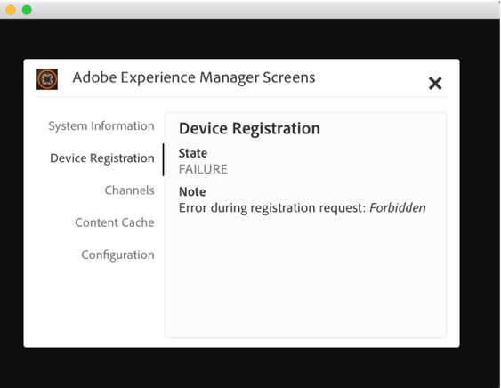
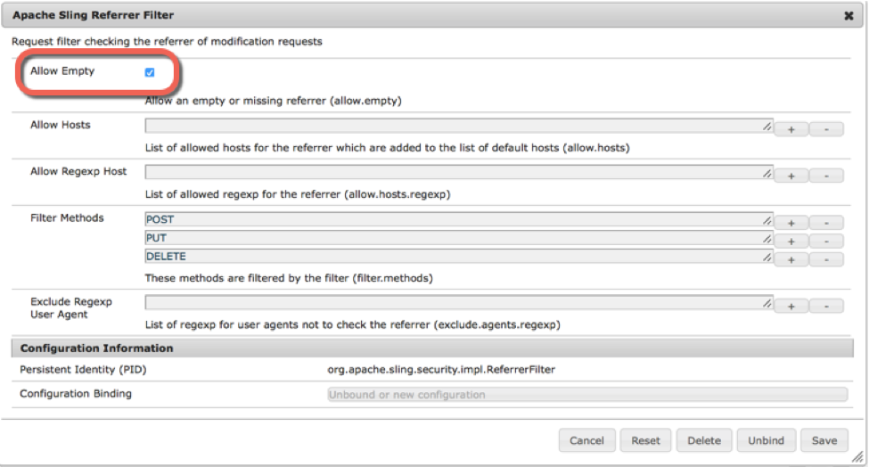
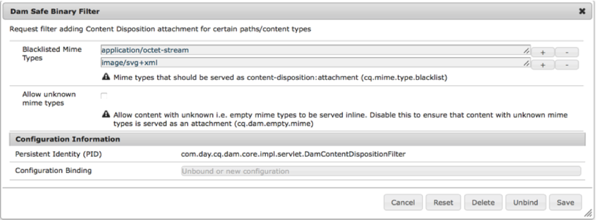
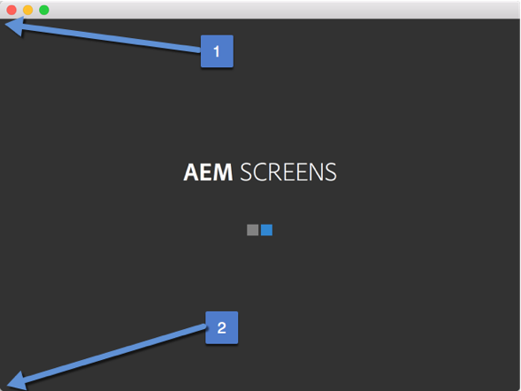
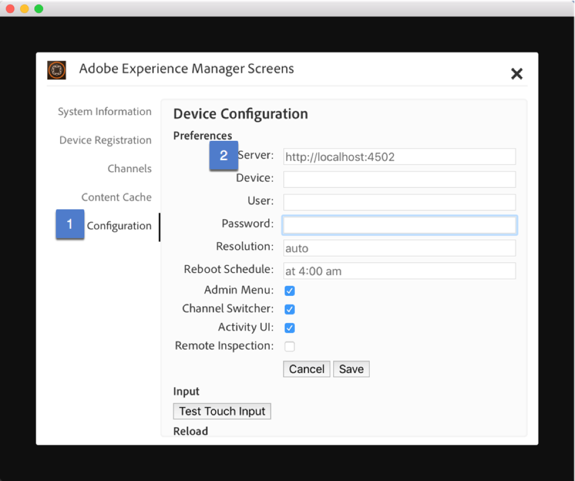
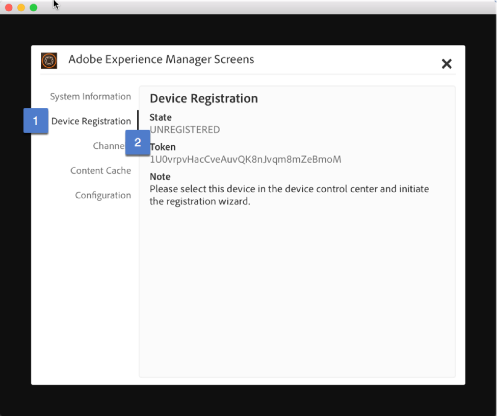

## Exercise 1 - Installing the Player

===========

## Objective
Install AEM Screens player

## Tasks

1.	Install from MacOS DMG file

 

2.  Starting AEM Screens Player

2.1  Double Click on the Screens Player app within Applications

**Note**
The AEM Screens player attempts to start in full screen mode.  To get out of full screen, simply hit the CTRL+Command+F        
**Note**
When starting AEM Screens player for the first time, you may get an error State.  In order for the Screens Player to function, a couple of AEM Author OSGI configurations must be made.

2.1  Open the Felix Console, find the Apache Sling Referrer filter --> http://localhost:4502/system/console/configMgr/org.apache.sling.security.impl.ReferrerFilter

Make sure that Allow Empty is checked

2.2  Open the Felix Console, find the Apache Sling Referrer filter -->  http://localhost:4502/system/console/configMgr/com.day.cq.dam.core.impl.servlet.DamContentDispositionFilter

Remove the line text/html

3. Configuring the player for registration

**Note**
If the configuration page is not visible, you can access one of the hidden links in the player

(1)	Approximately 5x5 pixels off the top left, is a hidden link to open the Configuration Page
(2) Approximately 5x5 pixels off the bottom left, is a hidden link to open Channel switcher.

3.1 Open the Configuration Menu (if its not already open) 

3.2 Configure the Server URL:  Put http://localhost:4502

3.3 Click on the Device Registration link from the Configuration Menu.  Validate that the State says "Unregistered" & that there is a valid token

