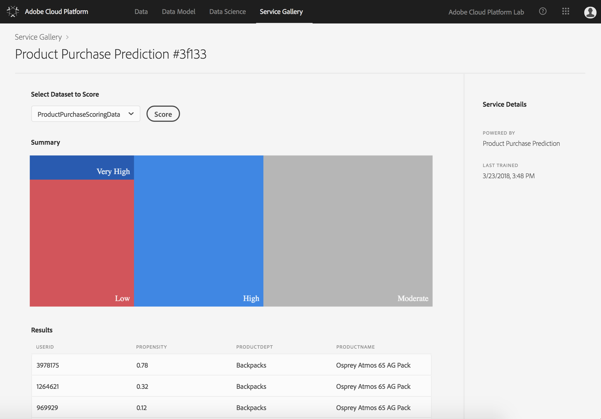

# Exercise 3 - Intelligent Services and Making Predictions

⏳Time Allocated: 10 minutes

Login URL:
- Adobe Cloud Platform: https://ui-prod1-va7.cloud.adobe.io/

Concepts:

  **Intelligent Service** - An intelligent service exposes the functionality of an artificial intelligence, or machine learning model, through an API so that it can be consumed easily by other services or applications.

 **Batch Scoring** - Making predictions for a batch of records. Batch Scoring is typically an asynchronous process, whereas real-time scoring is generally executed as a synchronous process on a single record.

Objectives:
- Select an Experiment and View Service
- Make Predictions Using Batch Scoring

## Log into the Adobe Cloud Platform

You may skip this step if you are already logged in.

1. Navigate to: https://ui-prod1-va7.cloud.adobe.io/
2. Authenticate using the provided credentials

## Select an Experiment and View Service

In the previous exercise you were asked to examine a number of experiments, review the Evaluation Metrics for each, then to identify the Experiment with the best accuracy.

1. Select the Experiment you would like to use for scoring
2. On the Experiment details page select the option to **View Service**

## Make Predictions Using Batch Scoring

A published service can be used for scoring operations to make predictions for new records.

1. In the **Select Dataset to Score** dropdown menu, choose **ProductPurchaseScoringData**
2. Click **Score**
3. Review the results

## Interpreting The Results

Once the scoring operation has completed you will be presented with a summary of the results as a segmentation chart. The propensity value represents the probablity that this specific user will purchase the Osprey Atmos 65 AG Pack.

| Summary | Propensity |
|:------|:------|
| Very High | 0.90 - 1.0 |
| High | 0.80 - 0.90 |
| Moderate | 0.50 - 0.80 |
| Low | 0.00 - 0.50 |

## Next Steps

In the next exercise you will leverage these predictions in Audience Manager to build segments.

Let's go! ➡[Exercise 4](../exercise4/README.md)

